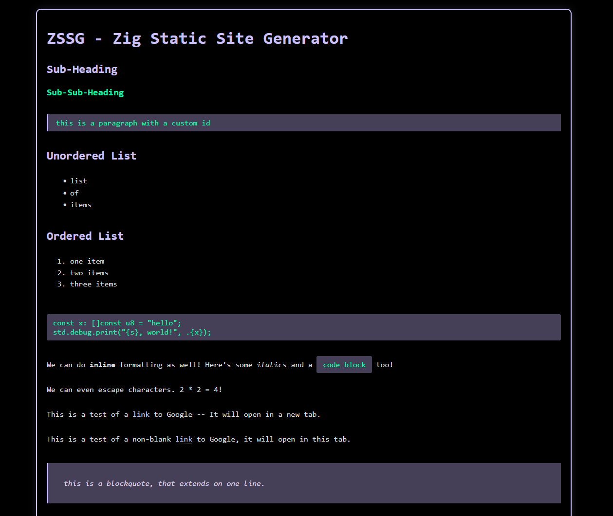

# ZSSG - Zig Static Site Generator

Zig Static Site Generator (ZSSG) is a static site generator written in Zig. The goal is to convert a markdown file into an HTML file to be served by a web server.

## Features

ZSSG supports all of the following:

- h1, h2, and h3 headings
- unordered and ordered lists
- tables
- sublists
- code blocks
- inline formatting (for bold, italics, and code)
- links and images
- custom ids for elements
- External stylesheets
- Custom page titles
- External JavaScript

## Example

To view the example, you can run the following:

```bash
zig build
cd test
../zig-out/bin/zssg
python3 -m http.server
```

You can then view the example at [http://localhost:8000/test](http://localhost:8000/test).


